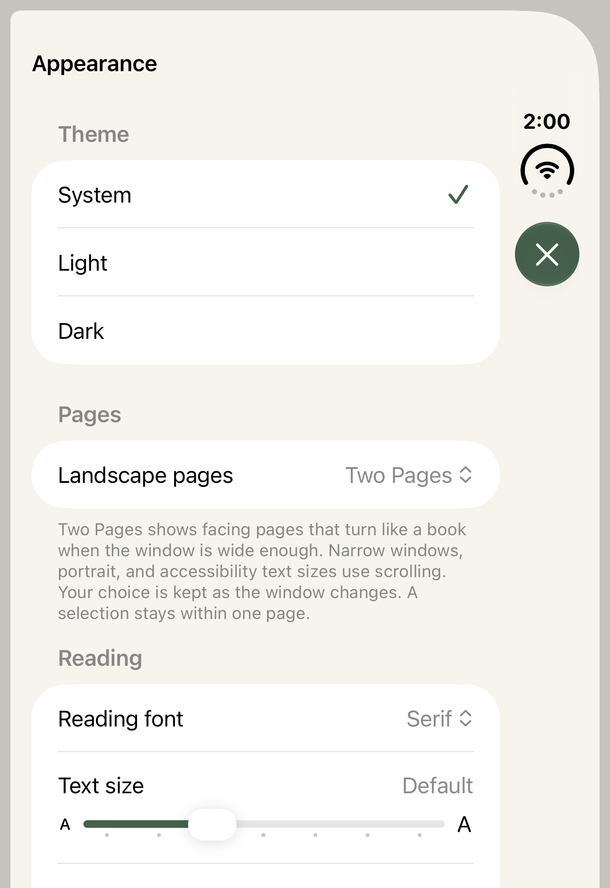
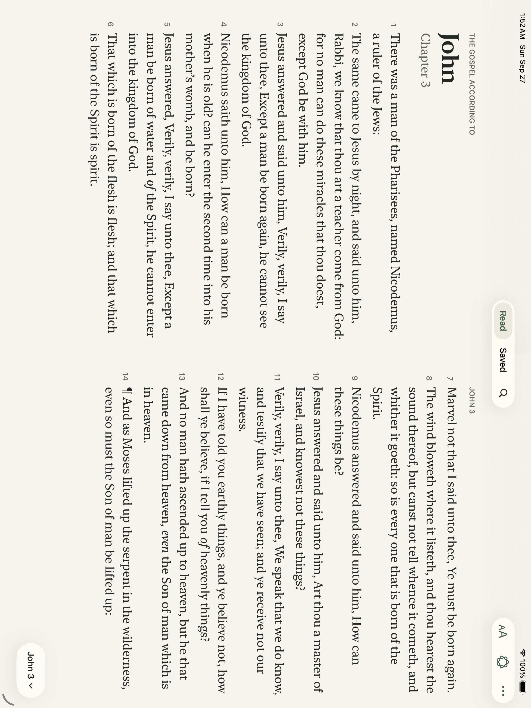
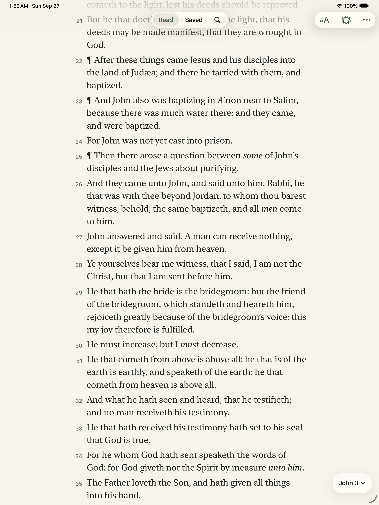

# Duo preparation validation — 27 September 2026

This is an initial adaptive-reader change, not Duo release acceptance. No physical Duo was tested.

Toolchain: Xcode **27.1 (27A9269)** from the owner's expanded download; iOS Simulator **27.1 SDK**, Debug, minimum deployment **26.0**. `DEVELOPER_DIR` selects the beta per command without changing system Xcode. XcodeBuildMCP CLI 2.7.0 runs the builds and tests. No project defaults file was present; each command supplies its project, scheme, configuration, and destination explicitly.

## Verified so far

- Compilation with the 27.1 SDK succeeded.
- iPhone 16e, **iOS 26.0**: all **15 tests passed**, no skips: 12 layout/pagination/preference tests plus compact page-preference persistence, local search/reference navigation, and exact highlight recolor/removal/Undo. The native spread test checks the retained reading anchor and semantic/native selection across 850–1000-point synthetic windows on a phone. These widths are test inputs, not hardware specifications.
- iPad Pro 13-inch (M5), **iOS 26.0**: four UI tests passed, no skips: facing-page forward/backward chapter turns and portrait restoration, top tabs/rotation, Saved-to-reader navigation, and Search/tab/rotation state.
- Reviewed the attached spread and restored-portrait screenshots from that passing UI run. They are iPad regression evidence, not Duo screenshots.
- iPhone 18 Pro, **iOS 27.0**: initial 11 layout/pagination/preference tests passed. A subsequent native spread resize test passed before the UI runner failed. Later mixed-suite attempts reported runner signal-kill/bootstrap failures even after unit assertions passed; those executions are failures, not clean passing suites.
- Actual **iPhone Duo, iOS 27.1 (24A94401)**: outer-display preference persistence and local Search/reference navigation passed (two tests; a wide-only spread test correctly skipped). On the fully open inner display, source notes, summary availability handling, exact-word Blue highlight/Saved navigation, and Search/tab/rotation state passed. Psalm 119 navigation and selection subsequently passed after correcting the test's offscreen chapter-cell lookup.
- After adding reserved-region layout, **iPad Pro 13-inch (M5), iOS 26.0** passed ten tests with no skips: nine layout/preference tests and the expanded facing-page test, including an exact-word highlight, Saved round trip, chapter turns, and return to scrolling. Result: `test_sim_2026-09-27T06-13-07-680Z_pid22957_2798d36a.xcresult`.
- Actual Duo book-pose diagnostics confirmed an active vertical division including margins. Seven layout tests passed on that runtime. The first pose test exposed an overly conservative width requirement beside the native side toolbar; book mode now uses its own narrower content budget.
- **Actual Duo book-pose UI test passed**: fresh Scroll preferences automatically show two pages; a swipe changes the visible passage; disabling automatic book layout restores the continuous John 3 reader. The first opt-out test tapped the row without changing the switch; the corrected test targets the native switch and verifies its value changes from 1 to 0. Result: `test_sim_2026-09-27T06-23-32-245Z_pid25290_fb50b9b3.xcresult`, one passed, no skips.
- Inner-display screenshot capture currently returns black images through both `XCUIScreen.main.screenshot()` and `app.screenshot()`, including the final passing flat-display run. These images are not included as visual proof. The Duo results establish the asserted native UI behavior and geometry, not a completed inner-display visual review.
- **Actual Duo horizontal-fold UI test passed** after rotating the existing partially folded pose with `XCUIDevice.orientation = .landscapeLeft`: the continuous reader is above the lower chapter controls, and Next Chapter changes John 3 to John 4. Device Hub did not offer the owner a distinct tabletop preset; this verifies a live horizontal reserved division, not a measured 90-degree hinge angle or physical ergonomics. Result: `test_sim_2026-09-27T06-26-21-117Z_pid25494_cad633ca.xcresult`, one passed, no skips. Reproduce with the book-pose command below, replacing `book` with `tabletop` and the test name with `testDuoTabletopKeepsChapterControlsBelowReader`.
- Flat-layout retries exposed unreliable XCTest orientation events/window queries on Duo: some runs stayed in a tall window, and an earlier run still had an active horizontal division. These failed runs are not flat-spread validation. The flat test now accepts `TEST_RUNNER_BIBLE_DUO_POSE_TEST=flat`, leaving Device Hub's operator-selected wide, fully open pose untouched, and explicitly chooses Scroll to verify reading-position restoration. iPad retains its rotation path.
- **Actual Duo flat wide-display UI test passed**: enable Two Pages; highlight only “There” in Blue; verify its exact excerpt in Saved; return to the spread; turn into John 4 and back to John 3; switch to Scroll and retain the visible passage. Result: `test_sim_2026-09-27T16-17-35-192Z_pid29421_9cd8296c.xcresult`, one passed, no skips, 65.6 seconds.

## Reproduce

Use the locally expanded beta location for `DEVELOPER_DIR`. Discover simulator identifiers with `xcodebuildmcp simulator list --enabled true`. The identifiers below are local simulator destinations, not physical-device identifiers.

Successful build:

```sh
DEVELOPER_DIR=/Users/kyle/Downloads/Xcode.app/Contents/Developer xcodebuildmcp simulator build \
  --project-path /Users/kyle/Developer/bible-ios/BibleReader.xcodeproj \
  --scheme BibleReader --configuration Debug \
  --simulator-id 0287C297-095D-4DD5-9C38-652D88A0ECCD \
  --derived-data-path /private/tmp/bible-duo-build
```

Successful iPad UI run:

```sh
DEVELOPER_DIR=/Users/kyle/Downloads/Xcode.app/Contents/Developer xcodebuildmcp simulator test \
  --project-path /Users/kyle/Developer/bible-ios/BibleReader.xcodeproj \
  --scheme BibleReader --configuration Debug \
  --simulator-id 382EB526-8B8C-40F7-861F-E08538F452C8 \
  --derived-data-path /private/tmp/bible-duo-build \
  --extra-args \
  '-only-testing:BibleReaderUITests/BibleReaderUITests/testWideTwoPageSpreadTurnsIntoNextChapterAndRestoresScroll' \
  '-only-testing:BibleReaderUITests/BibleReaderUITests/testIPadTopTabsAndRotationRestoration' \
  '-only-testing:BibleReaderUITests/BibleReaderUITests/testIPadSavedTabOpensReader' \
  '-only-testing:BibleReaderUITests/BibleReaderUITests/testSearchSurvivesIPadTabsAndRotation' \
  '-parallel-testing-enabled' 'NO'
```

Result bundle: `test_sim_2026-09-27T05-50-28-249Z_pid17970_e113b241.xcresult` in the local XcodeBuildMCP workspace result-bundles directory.

Successful iPhone regression run:

```sh
DEVELOPER_DIR=/Users/kyle/Downloads/Xcode.app/Contents/Developer xcodebuildmcp simulator test \
  --project-path /Users/kyle/Developer/bible-ios/BibleReader.xcodeproj \
  --scheme BibleReader --configuration Debug \
  --simulator-id 00228CE2-2A4E-4687-ADF6-A83BA5C65C17 \
  --derived-data-path /private/tmp/bible-duo-build \
  --extra-args \
  '-only-testing:BibleReaderTests/ReaderLayoutTests' \
  '-only-testing:BibleReaderTests/ChapterPaginationTests' \
  '-only-testing:BibleReaderTests/ReaderPreferencesTests' \
  '-only-testing:BibleReaderUITests/BibleReaderUITests/testPagePreferenceRemainsAvailableInCompactLayoutAndPersists' \
  '-only-testing:BibleReaderUITests/BibleReaderUITests/testSearchAndReferenceNavigation' \
  '-only-testing:BibleReaderUITests/BibleReaderUITests/testExactHighlightRecolorRemovalAndUndo' \
  '-parallel-testing-enabled' 'NO'
```

Result bundle: `test_sim_2026-09-27T05-55-10-297Z_pid19440_903fdf78.xcresult`.

## Evidence

Flat-display reproduction (operator sets Duo fully open and wider than tall before starting):

```sh
DEVELOPER_DIR=/Users/kyle/Downloads/Xcode.app/Contents/Developer \
TEST_RUNNER_BIBLE_DUO_POSE_TEST=flat xcodebuildmcp simulator test \
  --project-path /Users/kyle/Developer/bible-ios/BibleReader.xcodeproj \
  --scheme BibleReader --configuration Debug \
  --simulator-id BDB3E19F-1E4E-4A52-8755-1C539F934314 \
  --derived-data-path /private/tmp/bible-duo-device-build \
  --extra-args '-only-testing:BibleReaderUITests/BibleReaderUITests/testWideTwoPageSpreadTurnsIntoNextChapterAndRestoresScroll' \
  '-parallel-testing-enabled' 'NO'
```

Book-pose reproduction (requires the actual Duo already in a partially folded vertical-book pose):

```sh
DEVELOPER_DIR=/Users/kyle/Downloads/Xcode.app/Contents/Developer \
TEST_RUNNER_BIBLE_DUO_POSE_TEST=book xcodebuildmcp simulator test \
  --project-path /Users/kyle/Developer/bible-ios/BibleReader.xcodeproj \
  --scheme BibleReader --configuration Debug \
  --simulator-id BDB3E19F-1E4E-4A52-8755-1C539F934314 \
  --derived-data-path /private/tmp/bible-duo-device-build \
  --extra-args '-only-testing:BibleReaderUITests/BibleReaderUITests/testDuoBookPoseAutomaticallyTurnsPages' \
  '-parallel-testing-enabled' 'NO'
```







## Remaining Duo checks

The owner launched the actual Duo simulator and operates its fold controls. Device Hub UI automation times out, so pose-dependent tests use explicit opt-in test-runner environment variables and require the selected pose. Do not infer untested transitions from static-pose checks:

- Outer → inner → outer while scrolled, selecting words, editing annotations, searching, browsing Saved, and presenting the chapter picker.
- Visual review of book/tabletop poses, camera/toolbar clearance, and active occlusion regions. Static book and horizontal-division interaction checks above are complete.
- Interrupted curl, chapter endpoints, oversized verses/Psalm 119, and relaunch after folding.
- Accessibility text sizes, VoiceOver, Reduce Motion/Transparency, keyboard, both themes, and Split View.
- Fresh offline launch and normal feature parity. Physical-device selection/curl feel and performance remain separate release checks.
